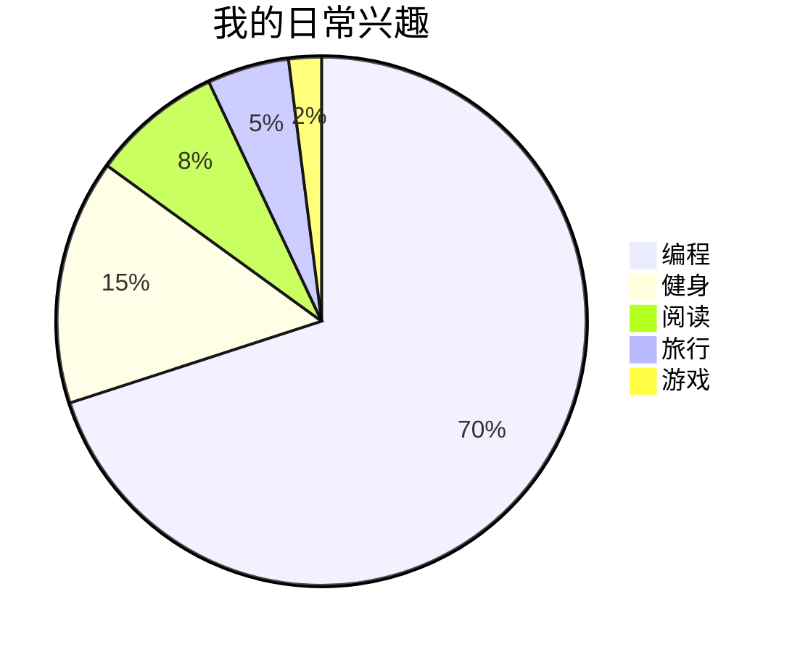

# 关于 Mxiaocao

我是 Mxiaocao，一名正在学习和实践软件工程的开发者。这个网站用来记录软件项目、计算机科学学习和工程实践，也用来整理那些值得回看的问题、方案与复盘。

## 编程之外

除了计算机编程，我也想记录那些让我停下来看的风景：山间的雾、西湖的雨、傍晚的蓝调时刻，或者街边小店里一碗热腾腾的馄饨。去看四季变化，去走还没走过的路，和把时间花在真正喜欢的事情上，都是生活的一部分。

## 我的时间分配

这张图记录的是我目前对日常时间的粗略分配。它不是统计报表，只是一个随阶段变化的生活侧影：

## 关于这个网站

本站基于 [Astro](https://astro.build/) 与 [Mizuki](https://github.com/matsuzaka-yuki/Mizuki) 构建，保留了主题原有的布局、搜索、归档、侧栏和其他交互功能。文章、项目和笔记会随着实际工作逐步整理和补充。

你可以在 [GitHub](https://github.com/Mxiaocao) 找到我的公开项目和代码。

